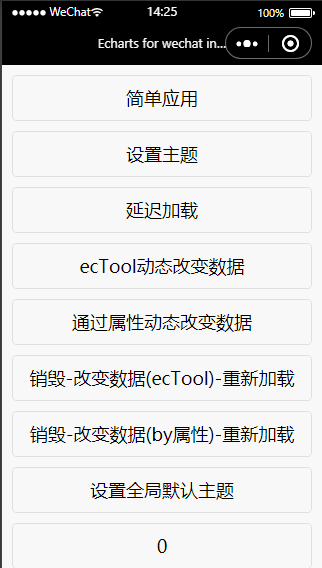

# V2.0.0  
## 介绍
该项目是 echart-wechart 在 remax 框架上的实践。  
理解该项目需要你有以下知识储备：  
1. 微信小程序开发相关知识  
2. [remax](https://remaxjs.org/guide/quick-start) 入门  
3. [echarts](https://echarts.apache.org/zh/tutorial.html#%E5%9C%A8%E5%BE%AE%E4%BF%A1%E5%B0%8F%E7%A8%8B%E5%BA%8F%E4%B8%AD%E4%BD%BF%E7%94%A8%20ECharts) 入门
### 项目一览  
首页  
  
简单应用  
  
设置主题  
  
数据更新  
  
延迟加载  
  
## Getting Start

安装依赖

```bash
npm install
```

调试项目

```bash
# 执行调试命令
$ npm run dev
or
yarn dev
```

使用小程序开发者工具打开项目下的 `dist` 目录。  
## 如何在你的项目中使用
将项目中 src/components/ 下的 ec-canvas 文件夹整个拷贝至你的项目中。  
具体的使用请查看 src/pages/ 下的各个文件夹，如简单使用则查看 src/pages/simple 。

